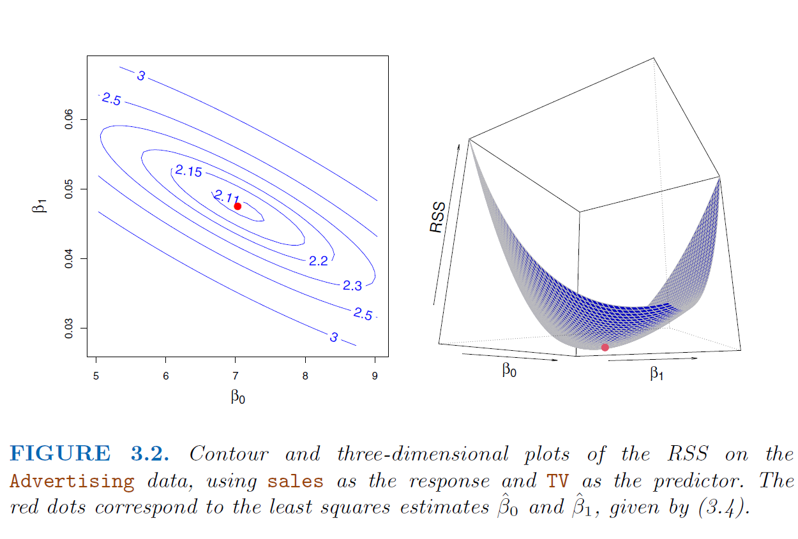

```{r setup, include=FALSE}
knitr::opts_chunk$set(echo = TRUE)
```

**SLR:** $Y \approx \beta_0 + \beta_1X, \hat{y} = \hat{\beta}_0 + \hat{\beta}_1x$ 

**RSS:** $RSS = e_1^2 + e_2^2 + \dots + e_n^2, \text{ where }e_i = y_i - \hat{y}_i$

**LSCE:** $\hat{\beta}_1 = \displaystyle \frac{\sum_{i=1}^{n}(x_i - \bar{x})(y_i - \bar{y})}{\sum_{i=1}^{n}(x_i - \bar{x})^2} \text{ and } \hat{\beta}_0 = \bar{y} - \hat{\beta}_1\bar{x}$

```{r figure3_2, echo = FALSE}




```

## Model Accuracy

*population regression line:* $Y = \beta_0 + \beta_1X + \epsilon \text{ (assume  } \epsilon \text{ is ind. of } X)$

Estimating  $\beta_0, \beta_1$ is analogous to estimating the population mean of a random variable by averaging estimates obtained over a large number of data sets (samples):

$\text{Var}(\hat{\mu}) = \text{SE}(\hat{\mu})^2 =\displaystyle \frac{\sigma^2}{n},$

where the *standard error* of $\hat{\mu} = SE(\hat{\mu})$ indicates the average amount the estimated mean differs from the population mean. **Assumes observations are uncorrelated.** 


```{r figure3, echo = FALSE}
knitr::include_graphics("figures/Chapter3/3_3.pdf")
```

$\text{SE}(\hat{\beta}_0)^2 = \sigma^2 \displaystyle \Bigg [\frac{1}{n} + \frac{\bar{x}^2}{\sum(x_i-\bar{x})^2} \Bigg ], \quad \text{SE}(\hat{\beta}_1)^2 = \frac{\sigma^2}{\sum(x_i - \bar{x})^2} \qquad (\textbf{Assume } \epsilon_i \text{ have common } \sigma^2)$

**RSE:** $\sqrt{\text{RSS}/(n-2)} \approx \sigma$ (which is typically unknown).

