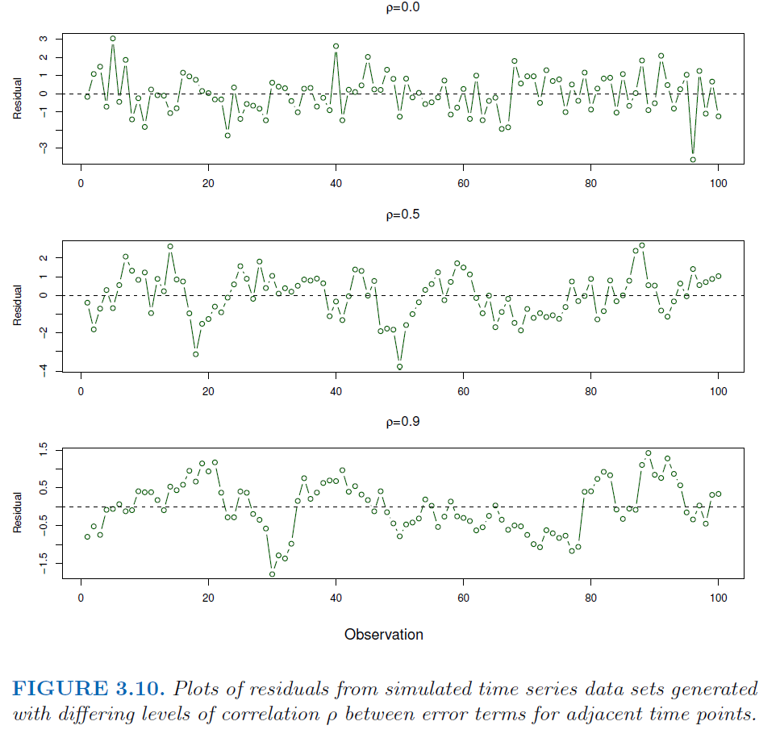

```{r setup, include=FALSE}
knitr::opts_chunk$set(echo = FALSE)
```

# Simple Linear Regression
**SLR:** $Y \approx \beta_0 + \beta_1X, \quad \hat{y} = \hat{\beta}_0 + \hat{\beta}_1x$ 

**RSS:** $\text{RSS} = \sum(y_i - \hat{y}_i)^2 \quad \text{ where }e_i = y_i - \hat{y}_i$

The *least squares approach* chooses $\hat{\beta}_0, \hat{\beta}_1$ to minimize the RSS: 

**LS Coefficent Estimates :** $\hat{\beta}_1 = \displaystyle \frac{\sum_{i=1}^{n}(x_i - \bar{x})(y_i - \bar{y})}{\sum_{i=1}^{n}(x_i - \bar{x})^2}, \qquad \hat{\beta}_0 = \bar{y} - \hat{\beta}_1\bar{x}$

```{r figure3_2, echo = FALSE}

knitr::include_graphics("figures/Chapter3/Ch3_fig2.png")


```

## Model Accuracy

*population regression line:* $Y = \beta_0 + \beta_1X + \epsilon \text{ (assume  } \epsilon \text{ is ind. of } X)$

Estimating  $\beta_0, \beta_1$ is analogous to estimating the population mean of a random variable by averaging estimates obtained over a large number of data sets (samples):

$\text{Var}(\hat{\mu}) = \text{SE}(\hat{\mu})^2 =\displaystyle \frac{\sigma^2}{n},$

where the *standard error* of $\hat{\mu} = SE(\hat{\mu})$ indicates the average amount the estimated mean differs from the population mean. **Assumes observations are uncorrelated.** 


```{r figure3, echo = FALSE}
knitr::include_graphics("figures/Chapter3/3_3.pdf")
```

We compute the standard errors of $\hat{\beta}_0, \hat{\beta}_1$:

$\text{SE}(\hat{\beta}_0)^2 = \sigma^2 \displaystyle \Bigg [\frac{1}{n} + \frac{\bar{x}^2}{\sum(x_i-\bar{x})^2} \Bigg ], \quad \text{SE}(\hat{\beta}_1)^2 = \frac{\sigma^2}{\sum(x_i - \bar{x})^2} \qquad (\textbf{Assume } \epsilon_i \text{ have common } \sigma^2)$

**RSE:** $\sigma \approx \sqrt{\text{RSS}/(n-2)} = \displaystyle \sqrt{\frac{1}{n-2}\sum{(y_i - \hat{y}_i)^2}} \qquad ( \sigma \text{ of  pop. } \epsilon \text{ unknown}).$

*"Another way to think about RSE/Stddev is that even if the model were correct and the true values of the unknown coefficients were known exactly, any prediction of sales on the basis of TV advertising would still be off by about (RSE) units on average."* RSE measures **lack of fit  in the units of** *Y*.  

$R^2 = \displaystyle \frac{\text{TSS} - \text{RSS}}{\text{TSS}} = 1 - \frac{\text{RSS}}{\text{TSS}} \qquad \text{ where TSS} = \sum(y_i - \bar{y})^2$

Measures the *proportion of variability in Y that can be explained using X*.

TSS: *measures total variance in the response Y and can be thought of as the amount of variability inherent in the response before the regression is performed.* 

RSS: *measures the amount of variability that remains unexplained after the regression.*

A low $R^2$ suggests that the linear model is wrong (e.g. missing predictors), or the error variance $\sigma^2$ is high, or both.

**Correlation:** $r = \text{Cor}(X,Y) = \displaystyle \frac{\sum(x_i - \bar{x})(y_i - \bar{y})}{\sqrt{\sum(x_i - \bar{x})^2}\sqrt{\sum(y_i - \bar{y})^2}}$
 
In **SLR**, $R^2 = r^2$, but *not* in **MLR** since correlation quantifies association between a single pair of variables. 

# Multiple Linear Regression

*population regression line:* $Y = \beta_0 + \beta_1X_1 + \beta_2X_2 + \dots + \beta_pX_p + \epsilon \qquad (\text{where } \beta_j = \text{avg. affect of unit incr. in X } c.p.)$. 

**MLR:** $\hat{y} = \hat{\beta}_0 + \hat{\beta}_1x_1 + \hat{\beta}_2x_2 + \dots + \hat{\beta}_px_p$

The parameters are estimated using same *least squares approach*, calculating $\hat{\beta}_0,..., \hat{\beta}_p$ (*MLR l.s.c.e.*) to **minimize RSS:** $\displaystyle \text{RSS} = \sum(y_i - \hat{y_i})^2 = \sum(y_i - \hat{\beta}_0 - \hat{\beta}_1x_{i1} - \dots - \hat{\beta}_px_{ip})^2$

```{r figure3_4}

```

**RSE:** $\text{RSE} = \displaystyle \sqrt{\frac{1}{n - p - 1}\text{RSS}}$


## Interlude: Calculating MLR lsce with Matrix Algebra

(ADD LATER)


## Resume: MLR vs SLR --- A Paradox

```{r}


```

```{r}
knitr::include_graphics("figures/Chapter3/Ch3_tab5.png")
```

MLR can suggest no relationship between a predictor and the response when SLR implies the opposite! Two predictors (e.g. temperature and ice cream) in separate SLRs can individually predict a response (e.g. shark attacks), but combining them in a MLR may reveal that one (junk) predictor is simply correlated with the other (good) predictor and that the junk predictor does not actually predict the response itself.


## Four Questions for MLR

1.) Is at least one of the predictors $X_1, X_2, ...,X_p$ useful in predicting *Y*?    
(*use hypothesis test, F-stat if not high-dim*)

2.) Do all the predictors help explain *Y* or just some?

3.) How well does the model fit the data?

4.) Given a set of predictor values, what response value should we predict, and how accurate is our prediction? 


### 1.) Hypothesis Testing: is there at least one useful predictor $X_i$?

$H_0 : \beta_1 = \beta_2 = \dots = \beta_p = 0$

$H_a : \text{at least one }\beta_j \text{ is non-zero.}$

**F-Stat:** $F = \displaystyle \frac{(\text{TSS} - \text{RSS})/p}{\text{RSS}/(n - p - 1)}, \qquad \text{ TSS} = \sum(y_i - \bar{y})^2, \quad \text{RSS} = \sum(y_i - \hat{y}_i)^2$

$E\{RSS/(n-p-1)\} = \sigma^2 \quad (\textit{If the linear model assumptions are correct})$

$E\{(TSS-RSS)/p\} = \sigma^2 \quad (\textit{If assumptions correct and } H_0 \textit{ is also true})$

$F \approx 1 \rightarrow \text{no relationship}$

**Size of F-Stat:** Given large *n*, an  *F*-statistic only slightly larger than 1 might be evidence against $H_0$. When $H_0$ true and errors $e_i$ are normally distributed, the *F*-statistic follows an *F*-distribution (with large enough *n* it approximately follows it).

**F-test:** $H_0: \beta_{p-q+1} = \beta_{p-q+2} = \dots =\beta_p = 0$ (*i.e.* that a particular subset of *q* of the coefficients are zero).

|    *Test model:* $\hat{y_0} = \hat{\beta}_0 +  \hat{\beta}_1x_1 + \dots + \hat{\beta}_px_p + 0(x_{p-q+1} + \dots + x_{p})$
|
|    *Model F-stat:* $F = \displaystyle \frac{(\text{RSS}_0 - \text{RSS})/q}{\text{RSS}/(n-p-1)} \quad$


In Table 3.4, the *t*-statistic for each individual predictor is equivalent to the *F*-test which omits the single variable from the model and leaves the rest in ($q = 1$): $t_i^2 = F_i^2$. In other words, each of these reports the *partial effect* of adding its respective variable to the model. **Warning:**

|   *High p:* even given individual *t*-statistics and p-values, **you still need overall F-statistic** --- especially when *p* is high. This is because the *F*-statistic adjusts for the number of predictors. 

|   *VERY-high p:* $p > n \implies |B_{1...p}| > n \implies \textit{ least squares is impossible}$, so not even *F*-stat is good enough. Use higher-dim methods like *forward selection.*

### 2.) Variable Selection

As alluded to in the warning, we can't just go by individual p-values --- if *p* large, some false discoveries are likely. **Three classical approaches** exist for reducing pool of potential models down from $2^p$ (see *Ch.6*):

|   *Forward selection*: Start with *null model* (only an intercept). Fit *p* SLRs and add to the null model the variable which gives lowest RSS. Add to new two-variable model the variable which gives lowest RSS. And so on till some rule is met.
|
|   *Backward selection*:  Start with all variables in the model, then remove the variable with the largest p-value. Then do that for the new $(p-1)$-variable model. And so on till some rule (e.g. when all remaining variables have p-value below some threshold). $\textbf{Impossible if } \ \ p > n.$
|
|   *Mixed selection*:  Start with forward selection and stop when the p-value for one variable rises above a given threshold. Remove that variable, then continue "forward" and "backward" until all variables inside the model have sufficiently low p-values and all variables outside would have a large p-value if added.


### 3.) Model Fit

```{r}
 
```
Notice the *synergy* effect. 

In *MLR*, $R^2 = \text{Cor}(Y, \hat{Y})^2$ --- the square of the correlation between the response and the fitted linear model. 

**R^2 Always Increases with p:** $\uparrow p \implies \downarrow \text{RSS (training)} \implies \uparrow R^2 \quad \text{since } R^2 = (\text{TSS} - \text{RSS})/(\text{TSS})$ 

But RSE might increase despite a decrease in RSS (if decrease in RSS is small relative to increase in *p*). (*Recall formula pg.3*)

### 4.) Predictions & Uncertainty 
 
**Three sorts of uncertainty** surround the use of MLR models to predict *Y* on the basis of $X_1, X_p,\dots, X_p$:

|       **A.)** $\hat{Y} \text{ to } f(X)$ (Reducible error): The *least squares plane* $\hat{Y} = \hat{\beta_0} +  \hat{\beta}_1X_1 + \dots +  \hat{\beta}_pX_p$ only *estimates* the *true population regression plane* $f(X) = \beta_0 +  \beta_1X_1 + \dots +  \beta_pX_p$. *Confidence Intervals* (CIs) estimate how close $\hat{Y}$ will be to $f(X)$.

|       **B.)** $f(X) \text{ to } Y$ (Irreducible error): $f(X)$ itself is only an estimate for *Y* given the irreducible error term.

What about uncertainty from $\hat{Y} \text{ to } Y?$ **Prediction Intervals** estimate how much *Y* will vary from $\hat{Y}$ --- these are wider than CIs because they include both **A.)** the error in the estimate for $f(X)$ and **B.)** the uncertainty as to how much a given point will differ from pop. regression plane.

|       **C.)** *Model bias* is frequently a problem in practice (most phenomena not truly linear). Ignore for now.

# Other Considerations
## Qualitative Predictors
```{r}
knitr::include_graphics("figures/Chapter3/3_6.pdf")

```
What do we do for the other four variables: own, student, (marital) status, and region? *Dummy-variables*.


```{r}

```

Here's an alternative coding scheme for a predictor with only two levels:

```{r}

```

## Extending the Linear Model

### A.) Relaxing the Additive Assumption (Interaction)

Including an *interaction term* can account for the synergy/interaction of two predictors $X_1, X_2$: 

$Y = \beta_0 + \beta_1X_1 + \beta_2X_2 + \beta_3X_1X_2 + \epsilon \quad = \quad \beta_0 + (\beta_1 + \beta_3X_2)X_1 + \beta_2X_2 + \epsilon \quad = \quad \beta_0 + \beta_1X_1 + (\beta_2 + \beta_3X_1)X_2 + \epsilon$ 

|   $\hat{\beta_1} = (\beta_1 + \beta_3X_2), \quad\hat{\beta}_2 = (\beta_2 + \beta_3X_1)$
|   $\implies$ associations between $X_1, Y$ and $X_2, Y$ no longer constant.

```{r}

```

*Hierarchical principle:* When including an *interaction term* in a model, always include the *main effects* too, even if the p-values of their coefficients aren't significant. 

**Qualitative-Quantitative Interaction:**

```{r}


```

```{r}

```


### B.) Polynomial Regression 
(ADD LATER)

## Potential Problems with Linear Regression

### 1.) Non-linearity of Data (use  *non-linear transformations* of the predictors)

```{r}

```

### 2.) Correlation of error terms (Tracking)

```{r}

```

If there is correlation among the error terms, the estimated standard errors will tend to underestimate the true standard errors. This causes CIs and PIs to be narrower and p-values to be lower than they should be.

### 3.) Non-constant variance of error terms (Heteroscedasticity)

```{r}
knitr::include_graphics("figures/Chapter3/3_11.pdf")
```

Another method for addressing heteroscedasticity for when we have good information about the variance of each response is called *weighted least squares*, where we fit weights proportional to the inverse variances ([link](https://www.itl.nist.gov/div898/handbook/pmd/section1/pmd143.htm#:~:text=If%20the%20standard%20deviation%20of,most%20precise%20parameter%20estimates%20possible.)).


### 4.) Outliers (unusual response value)

```{r}


```

Outliers without unusual predictor values often have little effect on least squares fit (see Left). But it can stil cause other problems, e.g.: 

|   $\uparrow \text{RSE} \rightarrow \ ?\text{CIs, } ?p\text{-values}, \qquad \downarrow R^2$ 

**Studentized residual:** Divide each $e_i$ by its estimated standard error.

### 5.) High-leverage points (unusual predictor value)

```{r}


```

An observation with an unusual predictor value is called a *high-leverage point* because of its strong effect on the regression line. 

**Leverage statistic (SLR)**: $\displaystyle h_i = \frac{1}{n} + \frac{(x_i - \bar{x})^2}{\sum_{j=1}^n(x_{j} - \bar{x})^2}$ 

### 6.) Collinearity 


$\rightarrow \ \uparrow \text{SE}(\hat{\beta}_j) \ \rightarrow \ \downarrow t\text{-stat} \ \rightarrow \ \downarrow \text{power}$

Detect with *correlation matrix* and *variance inflation factor* (VIF).

**VIF**: $\text{VIF}(\hat{\beta}_j) = \displaystyle \frac{1}{1-R^2_{X_j|X_{-j}}} \qquad \text{(where } R^2_{X_j|X_{-j}} \text{ is } R^2 \text{ from regression of } X_j \text{ onto rest of predictors})$

*Two Solutions*: **a.)** Drop one of the problematic variables **b.)** Combine them into a single predictor
```{r}


```

```{r}


```

```{r}


```

# LR vs. KNN Regression

$\uparrow K \  \rightarrow \ \downarrow \sigma^2, \uparrow \text{bias} \qquad \qquad \downarrow K \  \rightarrow \ \uparrow \sigma^2, \downarrow \text{bias}$

A *parametric method* like LR is easy to fit (estimate only a few coefficients), easier to interpret, and makes statistical significance tests easier. But they make strong assumptions about the form of $f(X)$. 

*Non-parametric methods* like *KNN regression* make no such assumption and are thus more flexible.

**KNN regression**: $\hat{f}(x_0) = \displaystyle \frac{1}{K}\sum_{x_i \in \mathcal{N}_0}y_i$

KNN can perform better when true relationship is non-linear, *K* is high, and *p* is small (low dimensions). Even then, LR might be preferable since it's more readily interpretable.  

```{r}


```
