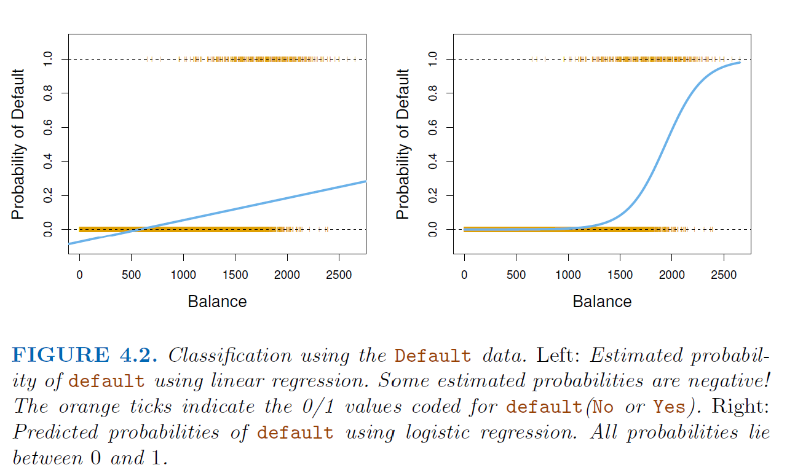
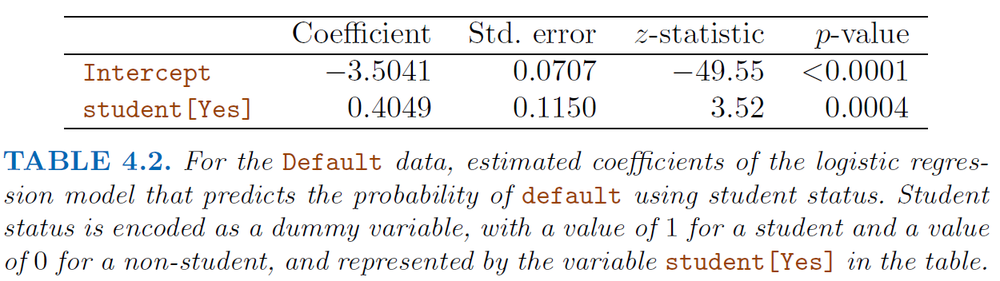
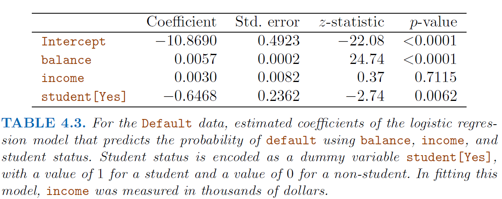
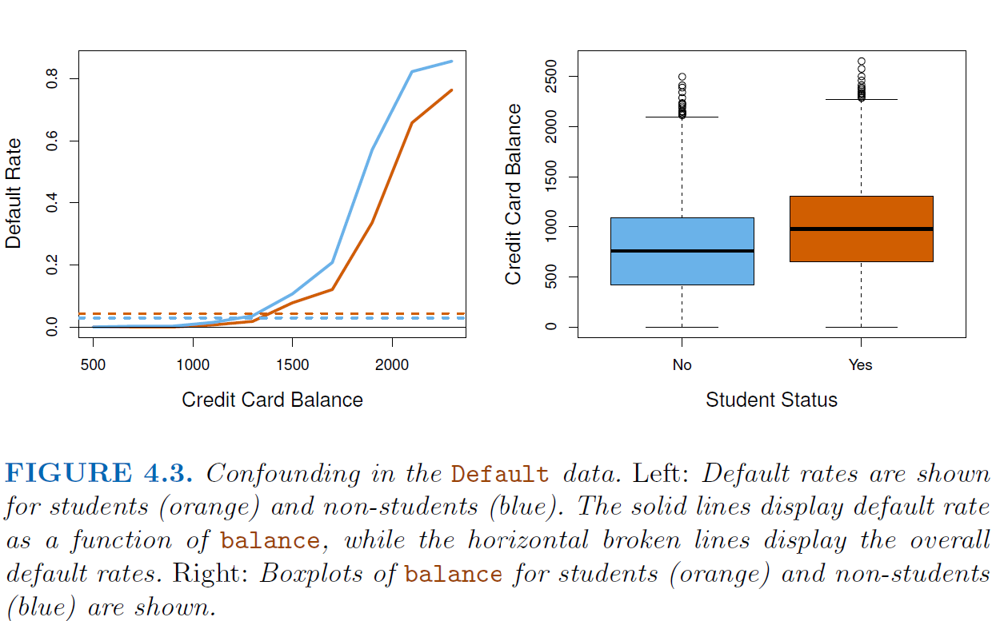

```{r setup, include=FALSE}
knitr::opts_chunk$set(echo = FALSE)
```

# Classification 

```{r fig2}

```

### Why not linear regrssion?

**a.)** LR can't accommodate qualitative response with more than two classes (unless there's some natural, even-spaced ordering to the classes)

**b.)** LR can't provide meaningful estimates of $\text{Pr}(Y|X)$ (some predictions might land outside [0,1] interval)

## Logistic Regression

$\displaystyle p(X) = \frac{e^{\beta_0 + \beta_1X}}{1 + e^{\beta_0+\beta_1X}} \qquad \qquad (4.2)$ 

*Odds:* $\displaystyle \frac{p(X)}{1-p(X)} = e^{\beta_0 + \beta_1X} \qquad \qquad (4.3)$

*Logit:* $\displaystyle \log \bigg ( \frac{p(X)}{1-p(X)} \bigg ) = \beta_0 + \beta_1X \qquad \qquad (4.4)$

Note that unlike linear regression, the amount $p(X)$ changes from a one-unit change in $X$ depends on the current value of $X$ (i.e. it's derivative is not constant). But the sign of $\beta_1$ still determines effect of $X$ on $p(X)$. 

**Likelihood function:** $\displaystyle \ell(\beta_0, \beta_1) = \prod_{i:y_i =1} p(x_i) \ \  \  \prod_{i':y_{i'} = 0} (1 - p(x_{i'})) \qquad \qquad (4.5)$ 

$\hat{\beta}_0, \hat{\beta}_1$ chosen to maximize likelihood function. The function is constructed so as to generate $\hat{p}(x_i)$ for each observation as close to 0/1 based on their classification. 


### Multiple Logistic Regression

$\displaystyle \log \bigg (\frac{p(X)}{1-p(X)} \bigg ) = \beta_0 + \beta_1X_1 + \dots + \beta_pX_p \qquad \qquad (4.6)$

$\displaystyle p(X) = \frac{e^{\beta_0 + \beta_1X_1 + \dots + \beta_pX_p}}{1 + e^{\beta_0 + \beta_1X_1 + \dots + \beta_pX_p}} \qquad \qquad (4.7)$ 

```{r}


```

```{r}


```

Why does the sign of the coefficient for student change from simple to multiple logistic regression? Students *tend to have higher credit balance* and thus, on average, have a higher default risk. But at a fixed credit balance, students have a lower default rate than non-students! This is called **confounding.**

```{r}


```

### Multinomial Logistic Regression: K > 2 classes 

*WLOG*, choose *K*-th class as the *baseline*. Then, for $k = 1, \dots, K-1$: 

$\displaystyle \text{Pr}(Y = k | X = x) = \frac{e^{\beta_{k0} + \beta_{k1}x_1 + \dots + \beta_{kp}x_p}}{1 + \sum_{l = 1}^{K-1} e^{\beta_{l0} + \beta_{l1}x_1 + \dots + \beta_{lp}x_p}} \qquad \qquad (4.10)$

$\displaystyle \text{Pr}(Y = K | X = x) = \frac{1}{1 + \sum_{l = 1}^{K-1} e^{\beta_{l0} + \beta_{l1}x_1 + \dots + \beta_{lp}x_p}} \qquad \qquad (4.11)$

$\displaystyle \log \bigg (\frac{\text{Pr}(Y=k | X = x)}{\text{Pr}(Y = K | X = x)} \bigg ) = \beta_{k0} + \beta_{k1}x_1 + \dots + \beta_{kp}x_p \qquad \qquad (4.12)$

Choice of baseline will afect the coefficient estimates but not the fitted values (predictions), the logits between any pair of classes, and other key model outputs. 


**Softmax coding** (Used in ML contexts): 


$\displaystyle \text{Pr}(Y = k | X = x) = \frac{e^{\beta_{k0} + \beta_{k1}x_1 + \dots + \beta_{kp}x_p}}{\sum_{l = 1}^{K} e^{\beta_{l0} + \beta_{l1}x_1 + \dots + \beta_{lp}x_p}} \qquad \qquad (4.13)$

$\displaystyle \log \bigg (\frac{\text{Pr}(Y=k | X = x)}{\text{Pr}(Y = k' | X = x)} \bigg ) = (\beta_{k0} - \beta_{k'0}) + (\beta_{k1} - \beta_{k'1})x_1 + \dots + (\beta_{kp} - \beta_{k'p})x_p \qquad \qquad (4.14)$


